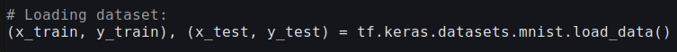
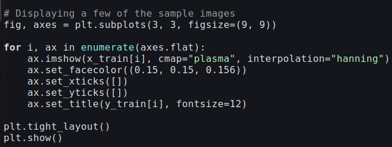
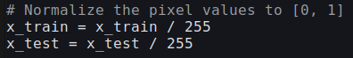

<h1 style="color: lime;"> Classification </h1>

1. **Load and Visualize the Dataset:**

CNN's are specialized for image data becuase they use the spatial structure of the
images and automatically learn the hierarchical features needed for classification.

Traditional machine learning models like logistic regression cannot effectivly capture
the relationships in images.

2. **Preprocess the Images:**

